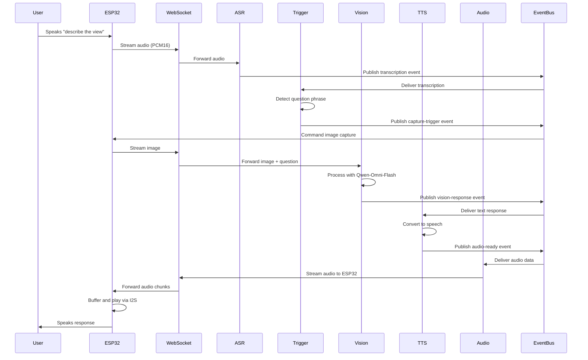

# Design Document: ESP32 Real-Time AI Assistant with TTS

## Overview

This design extends the existing "esp32-asr-capture-vision-mvp" system by adding text-to-speech (TTS) capabilities and bidirectional audio streaming. The system enables visually impaired users to ask questions about their surroundings through voice commands and receive spoken responses through an ESP32 speaker.

The design introduces three new components:
1. **Question_Trigger_Engine**: Detects question phrases in ASR transcriptions
2. **TTS_Adapter**: Converts text responses to speech audio
3. **Audio_Playback_Coordinator**: Manages audio streaming and playback on ESP32

The system reuses existing components (ASR_Bridge, Vision_Adapter, Event_Bus, WebSocket_Gateway) and extends the ESP32 firmware with I2S audio output capabilities.

### Key Design Decisions

- **Event-driven architecture**: All components communicate via Event_Bus for loose coupling
- **Streaming audio**: Bidirectional WebSocket streaming for low latency
- **Cooldown mechanism**: Prevents overlapping requests during audio playback
- **Pluggable TTS**: TTS_Adapter supports multiple TTS backends (Qwen TTS, etc.)
- **Buffer management**: ESP32 implements audio buffering to prevent glitches

## Architecture

### System Context

```
┌─────────────────────────────────────────────────────────────────┐
│                         ESP32 Device                             │
│  ┌──────────┐  ┌──────────┐  ┌──────────┐  ┌──────────┐       │
│  │Microphone│  │  Camera  │  │ I2S DAC  │  │ Speaker  │       │
│  └────┬─────┘  └────┬─────┘  └────┬─────┘  └────┬─────┘       │
│       │             │              │             │              │
│       └─────────────┴──────────────┴─────────────┘              │
│                     │                                            │
│              ┌──────▼──────┐                                     │
│              │  Firmware   │                                     │
│              │  (Arduino)  │                                     │
│              └──────┬──────┘                                     │
└─────────────────────┼────────────────────────────────────────────┘
                      │ WebSocket (bidirectional)
                      │
┌─────────────────────▼────────────────────────────────────────────┐
│                      Backend System                              │
│                                                                   │
│  ┌────────────────────────────────────────────────────────────┐ │
│  │                      Event Bus                              │ │
│  └───┬────────┬────────┬────────┬────────┬────────┬───────────┘ │
│      │        │        │        │        │        │              │
│  ┌───▼───┐┌──▼───┐┌───▼───┐┌───▼───┐┌───▼───┐┌───▼────────┐   │
│  │WebSock││ ASR  ││Trigger││Vision ││  TTS  ││   Audio    │   │
│  │Gateway││Bridge││Engine ││Adapter││Adapter││  Playback  │   │
│  │       ││      ││       ││       ││       ││Coordinator │   │
│  └───┬───┘└──┬───┘└───┬───┘└───┬───┘└───┬───┘└─────┬──────┘   │
│      │       │        │        │        │          │           │
└──────┼───────┼────────┼────────┼────────┼──────────┼───────────┘
       │       │        │        │        │          │
   ┌───▼───────▼────────▼────────▼────────▼──────────▼───┐
   │          External Services                           │
   │  ┌──────────────┐  ┌──────────────┐  ┌───────────┐ │
   │  │ Qwen3-ASR    │  │ Qwen-Omni    │  │ Qwen TTS  │ │
   │  │ Flash RT     │  │ Flash Vision │  │  Service  │ │
   │  └──────────────┘  └──────────────┘  └───────────┘ │
   └──────────────────────────────────────────────────────┘
```

### Request Flow



## Components and Interfaces

### Question_Trigger_Engine

**Responsibility**: Detect question phrases in ASR transcriptions and trigger image capture.

**Interface**:
```python
class QuestionTriggerEngine:
    def __init__(self, event_bus: EventBus, config: TriggerConfig):
        """Initialize with event bus and trigger configuration."""
        pass
    
    def start(self):
        """Subscribe to ASR transcription events."""
        pass
    
    def _on_transcription(self, event: TranscriptionEvent):
        """Handle incoming transcription events."""
        pass
    
    def _detect_trigger(self, text: str) -> Optional[TriggerMatch]:
        """Detect trigger phrases in text. Returns match with question context."""
        pass
    
    def _is_cooldown_active(self) -> bool:
        """Check if cooldown period is active to prevent overlapping requests."""
        pass
    
    def _emit_capture_trigger(self, question: str):
        """Emit capture trigger event with question context."""
        pass
```

**Configuration**:
```python
@dataclass
class TriggerConfig:
    english_triggers: List[str]  # ["describe the view", "what do I see", ...]
    chinese_triggers: List[str]  # ["描述一下景象", "我看到什麼", ...]
    cooldown_seconds: float = 3.0
    fuzzy_match_threshold: float = 0.85  # For partial matches
```

**Events Consumed**:
- `transcription.received` (from ASR_Bridge)

**Events Published**:
- `capture.trigger` (to Capture_Coordinator)

### TTS_Adapter

**Responsibility**: Convert text responses to speech audio using TTS service.

**Interface**:
```python
class TTSAdapter:
    def __init__(self, event_bus: EventBus, tts_client: TTSClient, config: TTSConfig):
        """Initialize with event bus, TTS client, and configuration."""
        pass
    
    def start(self):
        """Subscribe to vision response events."""
        pass
    
    def _on_vision_response(self, event: VisionResponseEvent):
        """Handle vision response and convert to speech."""
        pass
    
    async def _convert_to_speech(self, text: str, language: str) -> AudioData:
        """Convert text to speech audio. Returns PCM16 or MP3 audio."""
        pass
    
    def _emit_audio_ready(self, audio_data: AudioData, request_id: str):
        """Emit audio ready event."""
        pass
    
    def _emit_error(self, error: Exception, request_id: str):
        """Emit TTS error event."""
        pass
```

**Configuration**:
```python
@dataclass
class TTSConfig:
    service_url: str
    api_key: str
    voice_name: str = "default"
    language: str = "zh-CN"
    speed: float = 1.0
    pitch: float = 1.0
    audio_format: str = "pcm16"  # or "mp3"
    sample_rate: int = 16000
    timeout_seconds: float = 5.0
    retry_attempts: int = 1
```

**Events Consumed**:
- `vision.response` (from Vision_Adapter)
- `error.tts_required` (for error messages)

**Events Published**:
- `audio.ready` (to Audio_Playback_Coordinator)
- `tts.error` (on failure)

### Audio_Playback_Coordinator

**Responsibility**: Stream audio to ESP32 and manage playback state.

**Interface**:
```python
class AudioPlaybackCoordinator:
    def __init__(self, event_bus: EventBus, websocket_gateway: WebSocketGateway, config: PlaybackConfig):
        """Initialize with event bus, WebSocket gateway, and configuration."""
        pass
    
    def start(self):
        """Subscribe to audio ready events."""
        pass
    
    def _on_audio_ready(self, event: AudioReadyEvent):
        """Handle audio ready event and begin streaming."""
        pass
    
    async def _stream_audio(self, audio_data: AudioData, device_id: str):
        """Stream audio chunks to ESP32 via WebSocket."""
        pass
    
    def _on_playback_complete(self, device_id: str):
        """Handle playback completion from ESP32."""
        pass
    
    def _is_playback_active(self, device_id: str) -> bool:
        """Check if audio playback is currently active."""
        pass
    
    def _emit_playback_complete(self, device_id: str):
        """Emit playback complete event."""
        pass
```

**Configuration**:
```python
@dataclass
class PlaybackConfig:
    chunk_size: int = 4096  # Bytes per WebSocket message
    buffer_size: int = 16384  # ESP32 buffer size
    stream_timeout: float = 10.0
```

**Events Consumed**:
- `audio.ready` (from TTS_Adapter)
- `playback.complete` (from ESP32 via WebSocket)

**Events Published**:
- `playback.started` (when streaming begins)
- `playback.complete` (when playback finishes)
- `playback.error` (on streaming failure)

### ESP32 Firmware Extensions

**New Capabilities**:
1. I2S audio output configuration
2. Audio buffer management
3. Audio playback via I2S DAC
4. Playback state reporting

**Interface** (Arduino C++):
```cpp
class AudioPlayer {
public:
    AudioPlayer(int i2s_port, int bck_pin, int ws_pin, int data_pin);
    
    void begin();
    void setVolume(uint8_t volume);  // 0-100
    
    bool isPlaying();
    size_t getBufferSpace();
    
    void writeAudioData(uint8_t* data, size_t length);
    void play();
    void stop();
    
private:
    void configureI2S();
    void fillBuffer();
    void reportPlaybackComplete();
};
```

**Audio Buffer**:
- Ring buffer: 16KB
- Chunk size: 4KB
- Minimum buffer before playback: 8KB

### Modified Components

**WebSocket_Gateway** (existing component):
- Add audio streaming message type: `audio_chunk`
- Add playback control messages: `playback_complete`, `playback_error`
- Handle bidirectional audio streaming

**Event_Bus** (existing component):
- No modifications required (already supports all event types)

**Vision_Adapter** (existing component):
- Modify to accept question context in vision requests
- Pass question to Qwen-Omni-Flash as prompt context

## Data Models

### Events

```python
@dataclass
class TranscriptionEvent:
    """Published by ASR_Bridge when transcription is available."""
    device_id: str
    text: str
    language: str
    confidence: float
    timestamp: datetime
    is_final: bool

@dataclass
class CaptureTriggerEvent:
    """Published by Question_Trigger_Engine when question detected."""
    device_id: str
    question: str
    language: str
    timestamp: datetime
    request_id: str

@dataclass
class VisionResponseEvent:
    """Published by Vision_Adapter when vision processing completes."""
    device_id: str
    request_id: str
    description: str
    confidence: float
    timestamp: datetime

@dataclass
class AudioReadyEvent:
    """Published by TTS_Adapter when audio is ready."""
    device_id: str
    request_id: str
    audio_data: bytes
    audio_format: str  # "pcm16" or "mp3"
    sample_rate: int
    duration_seconds: float
    timestamp: datetime

@dataclass
class PlaybackCompleteEvent:
    """Published by Audio_Playback_Coordinator when playback finishes."""
    device_id: str
    request_id: str
    timestamp: datetime
```

### WebSocket Messages

```python
# ESP32 → Backend
{
    "type": "audio_stream",
    "device_id": "esp32_001",
    "audio_data": "<base64_encoded_pcm16>",
    "sequence": 123
}

{
    "type": "playback_complete",
    "device_id": "esp32_001",
    "request_id": "req_456"
}

# Backend → ESP32
{
    "type": "audio_chunk",
    "request_id": "req_456",
    "audio_data": "<base64_encoded_audio>",
    "sequence": 1,
    "total_chunks": 10,
    "format": "pcm16",
    "sample_rate": 16000
}

{
    "type": "capture_command",
    "request_id": "req_456",
    "question": "describe the view"
}
```

### Configuration

```python
@dataclass
class SystemConfig:
    """Overall system configuration."""
    asr_config: ASRConfig
    trigger_config: TriggerConfig
    vision_config: VisionConfig
    tts_config: TTSConfig
    playback_config: PlaybackConfig
    
    # Performance targets
    max_response_time_seconds: float = 10.0
    target_response_time_seconds: float = 5.0
    
    # Error messages (pre-configured)
    error_messages: Dict[str, str] = field(default_factory=lambda: {
        "asr_failed": "I couldn't understand that, please try again",
        "camera_failed": "Camera unavailable, please try again",
        "vision_failed": "I couldn't analyze the image, please try again",
        "tts_failed": "Audio system error",
        "network_lost": "Connection lost, reconnecting"
    })
```


## Correctness Properties

A property is a characteristic or behavior that should hold true across all valid executions of a system—essentially, a formal statement about what the system should do. Properties serve as the bridge between human-readable specifications and machine-verifiable correctness guarantees.

### Property 1: Audio Streaming Format Compliance

*For any* audio data captured by the ESP32 microphone, when streamed to the backend, the audio format SHALL be PCM16 at 16kHz mono, and the system SHALL maintain this format specification throughout the streaming pipeline.

**Validates: Requirements 1.1**

### Property 2: Network Resilience with Buffering

*For any* network interruption during audio streaming, the system SHALL buffer audio data locally, and when the connection is restored, all buffered audio SHALL be transmitted without data loss.

**Validates: Requirements 1.3**

### Property 3: Trigger Detection and Question Extraction

*For any* transcription containing a valid trigger phrase (English or Chinese), the Question_Trigger_Engine SHALL detect the trigger, extract the user's question text, and emit a capture event with the question context.

**Validates: Requirements 2.1, 2.5**

### Property 4: Cooldown Prevention

*For any* sequence of trigger phrases detected within 3 seconds, the Question_Trigger_Engine SHALL process only the first trigger and ignore all subsequent triggers until the current request completes.

**Validates: Requirements 2.4**

### Property 5: Image-Question Association

*For any* successfully captured image, the system SHALL associate the image with the corresponding user question text, and this association SHALL be maintained throughout the vision processing pipeline.

**Validates: Requirements 3.4**

### Property 6: Capture Retry Logic

*For any* image capture failure, the system SHALL retry up to 2 times, and if all attempts fail, SHALL emit an error event with appropriate error message.

**Validates: Requirements 3.3**

### Property 7: Vision Request Completeness

*For any* vision processing request, the Vision_Adapter SHALL include both the image data and the user's question text in the request to the vision model, and the response SHALL be formatted for natural speech output.

**Validates: Requirements 4.1, 4.3**

### Property 8: Vision Timeout Enforcement

*For any* vision processing request that exceeds 8 seconds, the system SHALL timeout the request and generate a fallback error response.

**Validates: Requirements 4.4**

### Property 9: Vision Error Handling

*For any* vision model error response, the system SHALL generate a fallback response indicating the system cannot process the image, rather than propagating the raw error.

**Validates: Requirements 4.5**

### Property 10: TTS Conversion Pipeline

*For any* text description from the vision model, the TTS_Adapter SHALL convert the text to audio in the configured format (PCM16 at 16kHz or MP3), and SHALL emit an audio-ready event containing the audio data.

**Validates: Requirements 5.1, 5.3, 5.5**

### Property 11: TTS Retry Logic

*For any* TTS conversion failure, the system SHALL retry once, and if both attempts fail, SHALL emit a TTS error event.

**Validates: Requirements 5.4**

### Property 12: Audio Streaming to ESP32

*For any* audio-ready event, the Audio_Playback_Coordinator SHALL stream the audio data to the ESP32 via WebSocket in chunks, and SHALL emit a playback-complete event when streaming finishes.

**Validates: Requirements 6.1, 6.5**

### Property 13: Playback Mutual Exclusion

*For any* device, when audio playback is in progress, the system SHALL reject new question processing requests until the playback-complete event is received.

**Validates: Requirements 6.3**

### Property 14: Audio Streaming Resilience

*For any* audio streaming interruption, the system SHALL either resume from the interruption point or restart playback, ensuring the user receives the complete audio response.

**Validates: Requirements 6.4**

### Property 15: Error Message Generation

*For any* component failure (ASR, capture, vision, TTS, network), the system SHALL generate a spoken error message appropriate to the specific failure type.

**Validates: Requirements 8.1**

### Property 16: Buffer Request on Low Buffer

*For any* ESP32 device, when the audio buffer level falls below the minimum threshold, the ESP32 SHALL request more audio data from the backend.

**Validates: Requirements 9.2**

### Property 17: Buffer Pre-fill Before Playback

*For any* audio playback initiation, the ESP32 SHALL ensure the audio buffer contains at least the minimum threshold of data before starting playback.

**Validates: Requirements 9.3**

### Property 18: Memory Cleanup After Playback

*For any* completed audio playback, the ESP32 SHALL release all audio buffers to free memory for subsequent requests.

**Validates: Requirements 11.2**

### Property 19: Concurrent Request Limitation

*For any* system state, the system SHALL limit concurrent audio processing to one request at a time, rejecting new requests while a request is in progress.

**Validates: Requirements 11.3**

### Property 20: Low Memory Protection

*For any* ESP32 device in a low memory state, the system SHALL reject new requests and play a pre-configured memory error message.

**Validates: Requirements 11.4**

## Error Handling

### Error Categories

1. **ASR Errors**
   - Transcription failure
   - Low confidence transcription
   - Audio format mismatch
   - Response: Spoken message "I couldn't understand that, please try again"

2. **Trigger Detection Errors**
   - No trigger phrase detected (not an error, just no action)
   - Cooldown active (silently ignore)

3. **Capture Errors**
   - Camera unavailable
   - Image transmission failure
   - Timeout
   - Response: Spoken message "Camera unavailable, please try again"
   - Retry: Up to 2 attempts

4. **Vision Processing Errors**
   - Vision model timeout (>8 seconds)
   - Vision model error response
   - Invalid image format
   - Response: Spoken message "I couldn't analyze the image, please try again"

5. **TTS Errors**
   - TTS service unavailable
   - TTS conversion failure
   - Invalid text input
   - Response: Log error, attempt pre-recorded error message
   - Retry: 1 attempt

6. **Audio Playback Errors**
   - WebSocket disconnection during streaming
   - ESP32 buffer overflow
   - I2S hardware failure
   - Response: Resume or restart playback, or spoken error message

7. **Network Errors**
   - WebSocket disconnection
   - Connection timeout
   - Response: Spoken message "Connection lost, reconnecting"
   - Action: Automatic reconnection with exponential backoff

### Error Recovery Strategy

```python
class ErrorRecoveryStrategy:
    """Defines recovery actions for different error types."""
    
    def handle_error(self, error: Exception, context: ErrorContext) -> RecoveryAction:
        if isinstance(error, ASRError):
            return RecoveryAction(
                message="I couldn't understand that, please try again",
                retry=False,
                reset_state=True
            )
        elif isinstance(error, CaptureError):
            return RecoveryAction(
                message="Camera unavailable, please try again",
                retry=True,
                max_retries=2,
                reset_state=True
            )
        elif isinstance(error, VisionError):
            return RecoveryAction(
                message="I couldn't analyze the image, please try again",
                retry=False,
                reset_state=True
            )
        elif isinstance(error, TTSError):
            return RecoveryAction(
                message="Audio system error",
                retry=True,
                max_retries=1,
                fallback_to_prerecorded=True
            )
        elif isinstance(error, NetworkError):
            return RecoveryAction(
                message="Connection lost, reconnecting",
                retry=True,
                exponential_backoff=True
            )
        else:
            return RecoveryAction(
                message="System error, please try again",
                retry=False,
                reset_state=True
            )
```

### Error Message Pre-recording

For critical errors (especially TTS failures), the system SHALL maintain pre-recorded error messages:

```python
PRERECORDED_ERRORS = {
    "asr_failed": "error_asr.pcm16",
    "camera_failed": "error_camera.pcm16",
    "vision_failed": "error_vision.pcm16",
    "tts_failed": "error_tts.pcm16",
    "network_lost": "error_network.pcm16",
    "memory_low": "error_memory.pcm16"
}
```

## Testing Strategy

### Dual Testing Approach

This feature requires both unit tests and property-based tests for comprehensive coverage:

- **Unit tests**: Verify specific examples, edge cases, error conditions, and integration points
- **Property tests**: Verify universal properties across all inputs through randomization

Unit tests focus on concrete scenarios and integration between components, while property tests validate that correctness properties hold across a wide range of generated inputs. Both are necessary and complementary.

### Property-Based Testing

**Library**: Use `hypothesis` for Python backend components

**Configuration**:
- Minimum 100 iterations per property test
- Each test tagged with: `Feature: esp32-realtime-ai-assistant-tts, Property {N}: {property_text}`

**Property Test Coverage**:

1. **Audio Streaming Properties**
   - Property 1: Audio format compliance
   - Property 2: Network resilience with buffering
   - Generate: Random audio data, network interruption scenarios

2. **Trigger Detection Properties**
   - Property 3: Trigger detection and question extraction
   - Property 4: Cooldown prevention
   - Generate: Random transcriptions with trigger phrases, timing variations

3. **Image Capture Properties**
   - Property 5: Image-question association
   - Property 6: Capture retry logic
   - Generate: Random images, questions, failure scenarios

4. **Vision Processing Properties**
   - Property 7: Vision request completeness
   - Property 8: Vision timeout enforcement
   - Property 9: Vision error handling
   - Generate: Random images, questions, timeout scenarios, error responses

5. **TTS Properties**
   - Property 10: TTS conversion pipeline
   - Property 11: TTS retry logic
   - Generate: Random text descriptions, failure scenarios

6. **Audio Playback Properties**
   - Property 12: Audio streaming to ESP32
   - Property 13: Playback mutual exclusion
   - Property 14: Audio streaming resilience
   - Generate: Random audio data, concurrent requests, interruption scenarios

7. **Error Handling Properties**
   - Property 15: Error message generation
   - Generate: Random component failures

8. **Resource Management Properties**
   - Property 16: Buffer request on low buffer
   - Property 17: Buffer pre-fill before playback
   - Property 18: Memory cleanup after playback
   - Property 19: Concurrent request limitation
   - Property 20: Low memory protection
   - Generate: Random buffer states, memory conditions, concurrent requests

### Unit Testing

**Focus Areas**:

1. **Component Integration**
   - Test Question_Trigger_Engine integration with Event_Bus
   - Test TTS_Adapter integration with TTS service
   - Test Audio_Playback_Coordinator integration with WebSocket_Gateway

2. **Specific Trigger Phrases**
   - Test each English trigger phrase individually
   - Test each Chinese trigger phrase individually
   - Test partial matches and fuzzy matching

3. **Error Scenarios**
   - Test specific error messages for each error type
   - Test pre-recorded error message fallback
   - Test error recovery sequences

4. **ESP32 Firmware**
   - Test I2S configuration
   - Test audio buffer management
   - Test playback state transitions

5. **Configuration**
   - Test TTS voice parameter configuration
   - Test audio format configuration
   - Test trigger phrase configuration from file
   - Test timeout configuration

### Integration Testing

**End-to-End Scenarios**:

1. **Happy Path**: User asks question → receives spoken response
2. **Network Interruption**: Connection lost during audio streaming → recovery
3. **Concurrent Requests**: Multiple questions in quick succession → cooldown enforcement
4. **Error Recovery**: Component failure → error message → system recovery
5. **Low Memory**: ESP32 low memory → request rejection → memory cleanup

### Performance Testing

While not part of correctness properties, performance should be monitored:

- End-to-end latency: Target <5 seconds, maximum 10 seconds
- TTS conversion time: Target <2 seconds
- Audio streaming latency: Target <200ms to start
- Memory usage: ESP32 should not exceed 80% memory utilization

### Test Data Generation

**For Property Tests**:

```python
from hypothesis import strategies as st

# Audio data generation
audio_data = st.binary(min_size=1024, max_size=16384)

# Transcription generation with trigger phrases
trigger_phrases = ["describe the view", "what do I see", "what's in front of me", 
                   "tell me what you see", "描述一下景象", "我看到什麼"]
transcriptions = st.text(min_size=10, max_size=200).map(
    lambda t: f"{t} {st.sampled_from(trigger_phrases)}"
)

# Image data generation
image_data = st.binary(min_size=1024, max_size=102400)

# Question generation
questions = st.text(min_size=5, max_size=100, alphabet=st.characters(
    whitelist_categories=('Lu', 'Ll', 'Lo')
))

# Audio format generation
audio_formats = st.sampled_from(["pcm16", "mp3"])

# Error scenarios
error_types = st.sampled_from([
    ASRError, CaptureError, VisionError, TTSError, NetworkError
])
```

### Mock Services

For testing without external dependencies:

```python
class MockTTSService:
    """Mock TTS service for testing."""
    def __init__(self, should_fail: bool = False, delay: float = 0.0):
        self.should_fail = should_fail
        self.delay = delay
    
    async def convert_to_speech(self, text: str, language: str) -> bytes:
        await asyncio.sleep(self.delay)
        if self.should_fail:
            raise TTSError("Mock TTS failure")
        return b"mock_audio_data" * 100

class MockVisionService:
    """Mock vision service for testing."""
    def __init__(self, should_fail: bool = False, delay: float = 0.0):
        self.should_fail = should_fail
        self.delay = delay
    
    async def analyze_image(self, image: bytes, question: str) -> str:
        await asyncio.sleep(self.delay)
        if self.should_fail:
            raise VisionError("Mock vision failure")
        return f"Mock description for: {question}"
```

## Implementation Notes

### ESP32 I2S Configuration

```cpp
// I2S configuration for audio output
i2s_config_t i2s_config = {
    .mode = (i2s_mode_t)(I2S_MODE_MASTER | I2S_MODE_TX),
    .sample_rate = 16000,
    .bits_per_sample = I2S_BITS_PER_SAMPLE_16BIT,
    .channel_format = I2S_CHANNEL_FMT_ONLY_LEFT,
    .communication_format = I2S_COMM_FORMAT_I2S_MSB,
    .intr_alloc_flags = ESP_INTR_FLAG_LEVEL1,
    .dma_buf_count = 8,
    .dma_buf_len = 1024,
    .use_apll = false,
    .tx_desc_auto_clear = true,
    .fixed_mclk = 0
};

// Pin configuration
i2s_pin_config_t pin_config = {
    .bck_io_num = 26,    // Bit clock
    .ws_io_num = 25,     // Word select
    .data_out_num = 22,  // Data out
    .data_in_num = -1    // Not used
};
```

### Audio Buffer Management

```cpp
#define AUDIO_BUFFER_SIZE 16384
#define MIN_BUFFER_THRESHOLD 8192
#define CHUNK_SIZE 4096

class AudioBuffer {
private:
    uint8_t buffer[AUDIO_BUFFER_SIZE];
    size_t write_pos = 0;
    size_t read_pos = 0;
    size_t available = 0;
    
public:
    size_t write(uint8_t* data, size_t length) {
        size_t space = AUDIO_BUFFER_SIZE - available;
        size_t to_write = min(length, space);
        
        for (size_t i = 0; i < to_write; i++) {
            buffer[write_pos] = data[i];
            write_pos = (write_pos + 1) % AUDIO_BUFFER_SIZE;
        }
        
        available += to_write;
        return to_write;
    }
    
    size_t read(uint8_t* data, size_t length) {
        size_t to_read = min(length, available);
        
        for (size_t i = 0; i < to_read; i++) {
            data[i] = buffer[read_pos];
            read_pos = (read_pos + 1) % AUDIO_BUFFER_SIZE;
        }
        
        available -= to_read;
        return to_read;
    }
    
    size_t getAvailable() { return available; }
    size_t getSpace() { return AUDIO_BUFFER_SIZE - available; }
    bool needsMoreData() { return available < MIN_BUFFER_THRESHOLD; }
};
```

### Trigger Phrase Matching

Use fuzzy matching to handle variations in transcription:

```python
from fuzzywuzzy import fuzz

class TriggerMatcher:
    def __init__(self, trigger_phrases: List[str], threshold: float = 0.85):
        self.trigger_phrases = trigger_phrases
        self.threshold = threshold
    
    def find_trigger(self, text: str) -> Optional[TriggerMatch]:
        text_lower = text.lower()
        
        for phrase in self.trigger_phrases:
            # Exact match
            if phrase in text_lower:
                return TriggerMatch(phrase=phrase, confidence=1.0, position=text_lower.index(phrase))
            
            # Fuzzy match
            ratio = fuzz.partial_ratio(phrase, text_lower)
            if ratio >= self.threshold * 100:
                return TriggerMatch(phrase=phrase, confidence=ratio/100, position=0)
        
        return None
```

### Event Bus Message Routing

```python
class EventBus:
    def __init__(self):
        self.subscribers: Dict[str, List[Callable]] = {}
    
    def subscribe(self, event_type: str, handler: Callable):
        if event_type not in self.subscribers:
            self.subscribers[event_type] = []
        self.subscribers[event_type].append(handler)
    
    async def publish(self, event_type: str, event_data: Any):
        if event_type in self.subscribers:
            tasks = [handler(event_data) for handler in self.subscribers[event_type]]
            await asyncio.gather(*tasks, return_exceptions=True)
```

### WebSocket Audio Streaming

```python
async def stream_audio_to_device(websocket, audio_data: bytes, chunk_size: int = 4096):
    """Stream audio to ESP32 in chunks."""
    total_chunks = (len(audio_data) + chunk_size - 1) // chunk_size
    
    for i in range(0, len(audio_data), chunk_size):
        chunk = audio_data[i:i+chunk_size]
        message = {
            "type": "audio_chunk",
            "audio_data": base64.b64encode(chunk).decode(),
            "sequence": i // chunk_size,
            "total_chunks": total_chunks,
            "format": "pcm16",
            "sample_rate": 16000
        }
        await websocket.send(json.dumps(message))
        await asyncio.sleep(0.01)  # Small delay to prevent overwhelming ESP32
```
